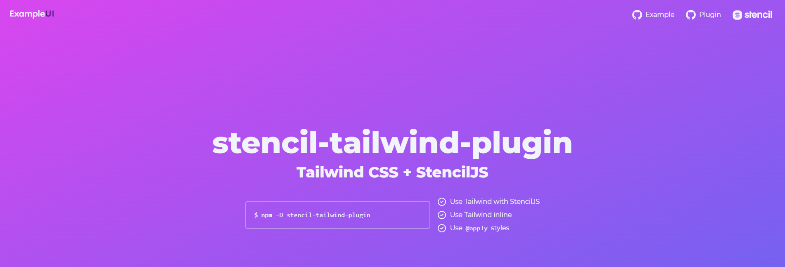

# stencil-tailwind-plugin-example

This repo is an example repo for showing the integration of the stencil-tailwind-plugin and StencilJS.

## Getting started with Stencil Component Example

Clone the repo, and install the dependencies:
```shell
cd stencil-component-starter
npm install
```

Start the stencil dev server:
```shell
npm start
```

If you would like to build the application:
```shell
npm run build
```

# Example output screen

As an example of what to expect


