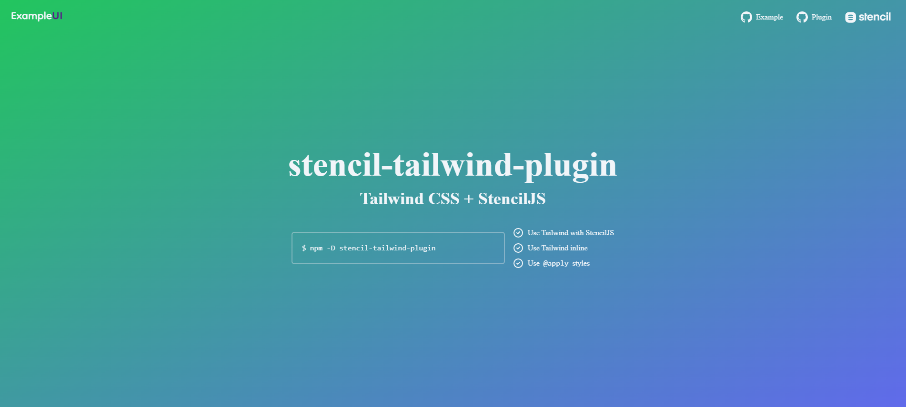

# stencil-tailwind-plugin-example

This repo is an example repo for showing the integration of the stencil-tailwind-plugin and StencilJS.

## Getting started with Stencil Component Example

Clone the repo, and install the dependencies:
```shell
cd stencil-component-starter
npm install
```

Start the stencil dev server:
```shell
npm start
```

If you would like to build the application:
```shell
npm run build
```

### Step used to make example

These are the step that where followed to make this example:

1. Install StencilJS
```shell
npm init stencil
```

Choose the options:
```
√ Pick a starter » component
√ Project name » stencil-component-example
```

2. Install dependencies:
```shell
cd stencil-component-example
npm install
```
At this point you should have a base stencil build with their default `my-component`. You can run up the application to check everything is working acceptably.

3. Add stencil plugins for `sass` and `stencil-tailwind-plugin`
```shell
npm install -D @stencil/sass stencil-tailwind-plugin
```

4. Update the configuration to use the plugins in `stencil.config.ts`:
```ts
import { Config } from '@stencil/core';
import { sass } from '@stencil/sass';
import tailwind from 'stencil-tailwind-plugin';

export const config: Config = {
  namespace: 'stencil-component-example',
  outputTargets: [
    // ...
  ],
  plugins: [
    sass(),
    tailwind()
  ]
};
```

It is important to run the `sass` plugin before `tailwind` plugin when using `sass` preprocessor. If you are *not* using `sass` then the `@stencil/sass` can be omitted.

5. Create a tailwind-based component:
```shell
npm run generate tw-basic-component
```

The output should look like:
```
The following files have been generated:
  - ./src/components/tw-basic-component/tw-basic-component.tsx
  - ./src/components/tw-basic-component/tw-basic-component.css
  - ./src/components/tw-basic-component/test/tw-basic-component.spec.tsx
  - ./src/components/tw-basic-component/test/tw-basic-component.e2e.ts
```

You can choose the options that make sense to your application.

6. Update the `tw-basic-component` with some tailwind goodness
```ts
@Component({
  tag: 'tw-basic-component',
  styleUrl: 'tw-basic-component.css',
  shadow: true,
})
export class TwBasicComponent {
  render() {
    return (
      <Host>
        <div class="bg-[#343da3] flex items-center justify-center">
          <div class="bg-[#5561E5] p-5 flex items-start justify-center flex-col w-6/12 rounded-lg">
            <h1 class="text-[3em] text-[#dedede] font-bold">
              Hello 👋, tailwind jit!
            </h1>
            <p class="text-[#fff]">
              Lorem, ipsum dolor sit amet consectetur adipisicing elit. Nam omnis
              fuga eum illo dolore odit, enim exercitationem quos ipsa numquam,
              ratione eveniet magni debitis illum molestias amet velit maxime
            </p>
            <button class="p-2 mt-4 bg-[#eee] rounded-md">Button</button>
          </div>
        </div>
      </Host>
    );
  }
}
```

This uses tailwind JIT styles as well as utility classes.

7. Start the dev server
```shell
npm start
```

9. Add our example component to the `index.html`
```html
<!-- src/index.html -->
    <my-component first="Stencil" last="'Don't call me a framework' JS"></my-component>
    <tw-basic-component></tw-basic-component>
```

8. View output

If everything went according to plan, the output should be similar to:


9. Bonus

The example app also contains a functional component `Card` that can be seen to use imported components with tailwind transitions. This example was taken from [codepen](https://codepen.io/muratbenli/pen/jOWJaZy).


