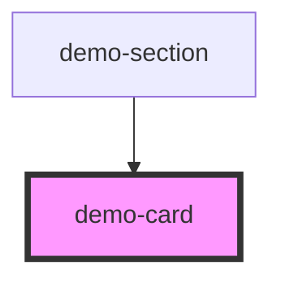

# demo-card

<!-- Auto Generated Below -->

## Properties

| Property    | Attribute    | Description | Type     | Default     |
| ----------- | ------------ | ----------- | -------- | ----------- |
| `cardTitle` | `card-title` |             | `string` | `undefined` |
| `subtitle`  | `subtitle`   |             | `string` | `undefined` |

## Dependencies

### Used by

 - [demo-section](../demo-section)

### Graph

----------------------------------------------

*Built with [StencilJS](https://stenciljs.com/)*
